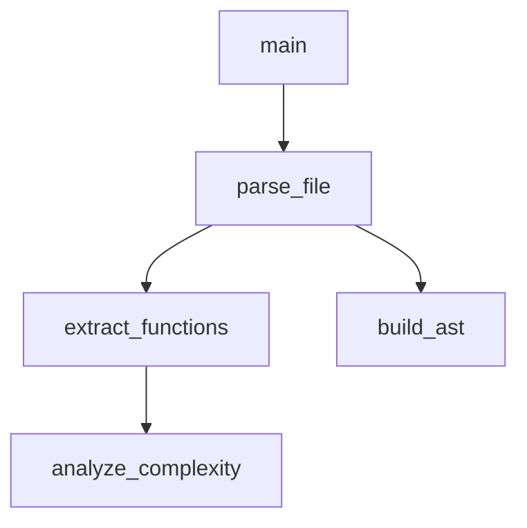

[English version](README.en.md)

# 🐍 Python and JS RAG System

Мощная система анализа Python и JS кода с использованием ChromaDB и LLM для создания интеллектуального RAG (Retrieval-Augmented Generation) решения.

## 🚀 Возможности

### 📊 Анализ кода
- **Парсинг AST**: Глубокий анализ Python кода с извлечением функций, классов, методов
- **Граф вызовов**: Построение детального графа вызовов функций
- **Граф зависимостей**: Анализ импортов и зависимостей между модулями
- **Метрики сложности**: Автоматический расчет сложности функций

### 🔍 Поиск и индексация
- **ChromaDB**: Векторная база данных для семантического поиска
- **Эмбеддинги**: Поддержка SentenceTransformers и Ollama (nomic-embed-text:v1.5)
- **Локальные модели**: Полностью приватная обработка через Ollama
- **Фильтрация**: Поиск по типу элементов (функции, классы, импорты)
- **Контекстный поиск**: Поиск с учетом контекста и связей

### 🧠 LLM интеграция
- **Поддержка провайдеров**: OpenAI GPT и локальные модели Ollama
- **Анализ функций**: Детальный анализ кода с помощью LLM
- **Flow объяснения**: Понимание потока выполнения программы
- **Ответы на вопросы**: Интеллектуальные ответы о коде
- **Предложения улучшений**: Рекомендации по оптимизации
- **Поиск похожих функций**: Анализ паттернов и сходств
- **Локальная обработка**: Полная приватность с Ollama

### 🛠️ Инструменты
- **CLI интерфейс**: Удобная командная строка
- **Интерактивный режим**: Диалоговый интерфейс для исследования
- **Экспорт документации**: Автоматическая генерация документации
- **Mermaid диаграммы**: Визуализация графов вызовов

## 🟦 Поддержка JavaScript (ES)

Система теперь поддерживает анализ и индексацию JavaScript (ES) проектов наряду с Python!

- **Парсинг JS**: Извлечение функций, классов, импортов из .js файлов
- **CLI**: Опция `--language javascript` для индексации JS-проектов
- **Совместимость**: Работает с современным ES-кодом (без TypeScript)
- **Требования**: Node.js и пакет `esprima` должны быть установлены (`npm install esprima`)

### Пример индексации JS-проекта

```bash
python -m python_rag_system.cli index ./your_js_project --language javascript
```

### Пример поиска по JS-коду

```bash
python -m python_rag_system.cli search "функция для обработки данных" --language javascript
```

### Программное использование для JS

```python
from python_rag_system import PythonRAGEngine

rag_engine = PythonRAGEngine(
    collection_name="my_js_project",
    persist_directory=".chroma_js_store",
    language="javascript"
)
summary = rag_engine.index_project("./my_js_project")
print(f"Проиндексировано {summary['total_elements']} элементов JS")
```

## 📦 Установка

### Требования
- Python 3.8+
- OpenAI API ключ (для OpenAI LLM) или Ollama (для локальных LLM)

### Установка зависимостей

```bash
pip install -r requirements.txt
```

### Установка зависимостей для JavaScript (Node.js)

Если вы хотите анализировать JavaScript-код, потребуется установленный Node.js и npm.

1. Установите Node.js: https://nodejs.org/
2. В корне проекта выполните инициализацию npm (если ещё не инициализировано):
   ```sh
   npm init -y
   ```
3. Установите необходимые зависимости:
   ```sh
   npm install esprima
   ```
4. Теперь доступны все функции анализа JS!

> Скрипт `js_parser.js` используется для пакетного парсинга JavaScript-файлов.

### Настройка языка интерфейса

Для смены языка сообщений системы (русский/английский) используйте переменную окружения в `.env`:

```
RAG_LANG=ru  # для русского (по умолчанию)
RAG_LANG=en  # для английского
```

Пример файла `.env`:
```
RAG_LANG=en
OPENAI_API_KEY=your-openai-api-key
...другие переменные...
```

### Настройка OpenAI API (опционально)

```bash
export OPENAI_API_KEY="your-openai-api-key"
```

Или создайте файл `.env`:
```
OPENAI_API_KEY=your-openai-api-key
```

### Настройка Ollama (рекомендуется)

Для полностью локального решения установите Ollama:

```bash
# Установка Ollama
curl -fsSL https://ollama.ai/install.sh | sh

# Запуск сервера
ollama serve

# Установка моделей для эмбеддингов
ollama pull nomic-embed-text:v1.5

# Установка LLM моделей для анализа кода
ollama pull gemma2:27b    # Лучшее качество (15GB)
ollama pull gemma2:9b     # Хороший баланс (5.4GB)
ollama pull llama3.1:8b   # Быстрая альтернатива (4.7GB)

# Автоматическая настройка
python setup_ollama.py
```

## 🎯 Быстрый старт

### 1. Индексация проекта

```bash
# Индексация с SentenceTransformers (по умолчанию)
python -m python_rag_system.cli index ./your_project

# Индексация с Ollama эмбеддингами
python -m python_rag_system.cli index ./your_project \
    --embedding-provider ollama \
    --embedding-model nomic-embed-text:v1.5

# С дополнительными опциями
python -m python_rag_system.cli index ./your_project \
    --collection-name my_project \
    --exclude __pycache__ \
    --exclude .git \
    --clear
```

### 2. Поиск по коду

```bash
# Простой поиск
python -m python_rag_system.cli search "функция для обработки данных"

# Поиск с фильтрами
python -m python_rag_system.cli search "анализ" \
    --type-filter function \
    --limit 10
```

### 3. Анализ функций

```bash
# Анализ с Ollama LLM (рекомендуется)
python -m python_rag_system.cli analyze parse_file \
    --llm-provider ollama \
    --model gemma2:27b

# Анализ с OpenAI
python -m python_rag_system.cli analyze parse_file \
    --llm-provider openai \
    --model gpt-4

# Анализ flow выполнения
python -m python_rag_system.cli flow main_function \
    --llm-provider ollama

# Предложения по улучшению
python -m python_rag_system.cli improve complex_function \
    --llm-provider ollama \
    --model gemma2:9b

# Ответы на вопросы
python -m python_rag_system.cli ask "Как работает парсинг кода?" \
    --llm-provider ollama
```

### 4. Интерактивный режим

```bash
# Интерактивный режим с Ollama (полностью локально)
python -m python_rag_system.cli interactive \
    --embedding-provider ollama \
    --embedding-model nomic-embed-text:v1.5 \
    --llm-provider ollama \
    --llm-model gemma2:27b

# Интерактивный режим с OpenAI
python -m python_rag_system.cli interactive \
    --llm-provider openai \
    --llm-model gpt-4
```

## 💻 Программное использование

### Базовое использование

```python
from python_rag_system import PythonRAGEngine
from python_rag_system.core.unified_llm_analyzer import UnifiedLLMCodeAnalyzer

# Инициализация RAG движка с Ollama (рекомендуется)
rag_engine = PythonRAGEngine(
    collection_name="my_project",
    persist_directory=".chroma_store",
    embedding_provider="ollama",
    embedding_model="nomic-embed-text:v1.5"
)

# Альтернативно с SentenceTransformers
rag_engine_st = PythonRAGEngine(
    collection_name="my_project_st",
    persist_directory=".chroma_st_store",
    embedding_provider="sentence_transformers",
    embedding_model="all-MiniLM-L6-v2"
)

# Индексация проекта
summary = rag_engine.index_project("./my_project")
print(f"Проиндексировано {summary['total_elements']} элементов")

# Поиск
results = rag_engine.search("функция для парсинга", n_results=5)
for result in results:
    print(f"Найдено: {result['metadata']['name']}")

# LLM анализ с Ollama (полностью локально)
analyzer = UnifiedLLMCodeAnalyzer(
    rag_engine=rag_engine,
    llm_provider="ollama",
    model="gemma2:27b"
)

# Альтернативно с OpenAI
analyzer_openai = UnifiedLLMCodeAnalyzer(
    rag_engine=rag_engine,
    llm_provider="openai",
    model="gpt-4"
)

# Анализ функции
analysis = analyzer.analyze_function("my_function")
analyzer.display_analysis_result(analysis, "function")
```

### Программное использование для JS

```python
from python_rag_system import PythonRAGEngine

rag_engine = PythonRAGEngine(
    collection_name="my_js_project",
    persist_directory=".chroma_js_store",
    language="javascript"
)
summary = rag_engine.index_project("./my_js_project")
print(f"Проиндексировано {summary['total_elements']} элементов JS")
```

### Продвинутое использование

```python
# Получение контекста функции
context = rag_engine.get_function_context("main_function")
print(f"Функция вызывает: {len(context['callees'])} других функций")

# Анализ flow
flow_analysis = analyzer.explain_code_flow("entry_point")
print(flow_analysis['llm_explanation'])

# Ответы на вопросы
answer = analyzer.answer_code_question(
    "Как работает система кэширования?",
    context_search="cache"
)
print(answer['answer'])

# Поиск похожих функций
similar = analyzer.find_similar_functions("process_data")
print(similar['similarity_analysis'])
```

## 🏗️ Архитектура

### Компоненты системы

```
python_rag_system/
├── core/
│   ├── code_parser.py      # Парсинг Python кода
│   ├── rag_engine.py       # ChromaDB и поиск
│   └── llm_integration.py  # LLM анализ
├── cli.py                  # Командный интерфейс
└── __init__.py
```

### Поток данных

1. **Парсинг** → AST анализ → Извлечение элементов
2. **Индексация** → Создание эмбеддингов → Сохранение в ChromaDB
3. **Поиск** → Векторный поиск → Ранжирование результатов
4. **LLM анализ** → Контекст + промпт → Интеллектуальный ответ

## 📋 Команды CLI

### Основные команды

| Команда | Описание | Пример |
|---------|----------|--------|
| `index` | Индексация проекта | `cli index ./project` |
| `search` | Поиск по коду | `cli search "функция"` |
| `analyze` | Анализ функции | `cli analyze my_func` |
| `flow` | Анализ flow | `cli flow main` |
| `ask` | Вопрос о коде | `cli ask "Как работает?"` |
| `improve` | Улучшения | `cli improve func` |
| `similar` | Похожие функции | `cli similar func` |
| `stats` | Статистика | `cli stats` |
| `interactive` | Интерактивный режим | `cli interactive` |

### Опции

| Опция | Описание | По умолчанию |
|-------|----------|--------------|
| `--collection-name` | Имя коллекции | `python_code_rag` |
| `--persist-dir` | Директория ChromaDB | `.chroma_rag_store` |
| `--model` | Модель LLM | `gpt-4` |
| `--limit` | Лимит результатов | `5` |
| `--type-filter` | Фильтр по типу | - |
| `--exclude` | Исключить паттерны | - |
| `--language` | Язык проекта (python/javascript) | `python` |

## 🔧 Конфигурация

### Переменные окружения

```bash
# OpenAI API
export OPENAI_API_KEY="your-key"

# ChromaDB настройки
export CHROMA_PERSIST_DIR=".chroma_store"
export CHROMA_COLLECTION_NAME="my_project"

# Модель эмбеддингов
export EMBEDDING_MODEL="all-MiniLM-L6-v2"
```

### Настройка исключений

```python
exclude_patterns = [
    '__pycache__',
    '.git',
    '.venv',
    'node_modules',
    '*.pyc',
    'tests/',
    'docs/'
]

rag_engine.index_project(project_path, exclude_patterns)
```

## 📊 Примеры использования

### 1. Анализ архитектуры проекта

```python
# Получаем общую статистику
summary = rag_engine.get_project_summary()
print(f"Функций: {summary['functions']}")
print(f"Классов: {summary['classes']}")
print(f"Связей: {summary['call_graph_edges']}")

# Находим самые сложные функции
complex_functions = rag_engine.search(
    "high complexity", 
    filter_type="function",
    n_results=10
)
```

### 2. Исследование зависимостей

```python
# Анализ импортов
imports = rag_engine.search("", filter_type="import", n_results=50)
for imp in imports:
    print(f"Импорт: {imp['metadata']['name']}")

# Граф зависимостей
mermaid_graph = rag_engine.parser.export_call_graph_mermaid()
with open("dependencies.mmd", "w") as f:
    f.write(mermaid_graph)
```

### 3. Поиск паттернов

```python
# Поиск всех функций с обработкой ошибок
error_handling = rag_engine.search("try except error handling")

# Поиск функций с async/await
async_functions = rag_engine.search("", filter_type="async_function")

# Анализ паттернов с LLM
for func in async_functions[:5]:
    analysis = analyzer.analyze_function(func['metadata']['name'])
    print(analysis['llm_analysis'])
```

### 4. Документирование кода

```python
# Генерация документации
docs = rag_engine.generate_project_documentation()

# Анализ недокументированных функций
undocumented = []
for element in rag_engine.parser.elements.values():
    if element.type == 'function' and not element.docstring:
        undocumented.append(element.name)

# Генерация документации с LLM
for func_name in undocumented[:10]:
    analysis = analyzer.analyze_function(func_name)
    # Извлекаем предложения по документированию
```

## 🎨 Визуализация

### Mermaid диаграммы

Система автоматически генерирует Mermaid диаграммы:



### Rich интерфейс

Красивый вывод в терминале с подсветкой синтаксиса, таблицами и панелями.

## 🧪 Тестирование

### Тестирование на больших JS-проектах

Для проверки системы на реальных JS-проектах используйте:

```bash
python -m python_rag_system.cli index ./path/to/large-js-project --language javascript
python -m python_rag_system.cli search "название функции" --language javascript
```

- Система корректно индексирует большие JS codebases (100+ файлов)
- Поддерживаются ES6+ классы, функции, импорты
- Для TypeScript используйте предварительную компиляцию в JS

```bash
# Запуск демонстрации
python example_usage.py

# Тестирование на собственном проекте
python -m python_rag_system.cli index ./python_rag_system
python -m python_rag_system.cli interactive
```

## 🤝 Интеграция с IDE

### VS Code

Создайте задачи в `.vscode/tasks.json`:

```json
{
    "version": "2.0.0",
    "tasks": [
        {
            "label": "RAG: Index Project",
            "type": "shell",
            "command": "python",
            "args": ["-m", "python_rag_system.cli", "index", "${workspaceFolder}"]
        },
        {
            "label": "RAG: Interactive",
            "type": "shell",
            "command": "python",
            "args": ["-m", "python_rag_system.cli", "interactive"]
        }
    ]
}
```

## 📈 Производительность

### Оптимизация

- **Батчевая индексация**: Обработка файлов группами
- **Кэширование эмбеддингов**: Переиспользование векторов
- **Фильтрация по типам**: Ускорение поиска
- **Ограничение глубины**: Контроль рекурсии в графах

### Масштабирование

- Поддержка больших проектов (1000+ файлов)
- Инкрементальная индексация
- Параллельная обработка файлов
- Оптимизированные запросы к ChromaDB

## 🔒 Безопасность

- Локальное хранение данных в ChromaDB
- Опциональная интеграция с LLM
- Фильтрация чувствительных файлов
- Контроль доступа к API ключам

## 🐛 Отладка

### Логирование

```python
import logging
logging.basicConfig(level=logging.DEBUG)

# Включить подробные логи ChromaDB
os.environ['CHROMA_LOG_LEVEL'] = 'DEBUG'
```

### Диагностика

```bash
# Проверка статистики
python -m python_rag_system.cli stats

# Проверка конкретного файла
python -m python_rag_system.cli file-summary path/to/file.py

# Тестовый поиск
python -m python_rag_system.cli search "test" --limit 1
```

## 📚 Дополнительные ресурсы

- [ChromaDB документация](https://docs.trychroma.com/)
- [Sentence Transformers](https://www.sbert.net/)
- [OpenAI API](https://platform.openai.com/docs)
- [Rich библиотека](https://rich.readthedocs.io/)

## 🤝 Вклад в проект

1. Форкните репозиторий
2. Создайте ветку для новой функции
3. Добавьте тесты
4. Отправьте Pull Request

## 📄 Лицензия

MIT License - см. файл LICENSE

## 🙋‍♂️ Поддержка

Если у вас есть вопросы или предложения:

1. Создайте Issue в GitHub
2. Опишите проблему подробно
3. Приложите примеры кода
4. Укажите версию Python и ОС

---

**Создано с ❤️ для разработчиков Python и JavaScript ES**
